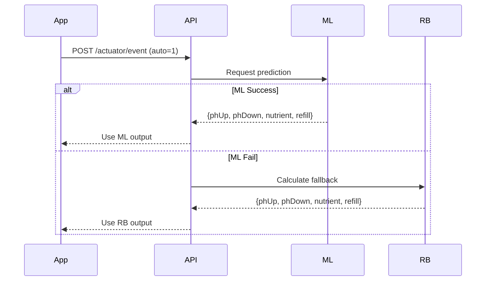

# Control Systems Documentation

Technical specification of the control systems implemented in the CEA Hydroponics project.

---

## Table of Contents

- [System Overview](#system-overview)
- [Rule-Based Control](#rule-based-control)
- [Machine Learning Control](#machine-learning-control)
- [System Integration](#system-integration)
- [API Reference](#api-reference)

---

# System Overview

The CEA Hydroponics system employs two complementary control mechanisms:

| System | Primary Function | Implementation |
|--------|-----------------|----------------|
| **Rule-Based (RB)** | Emergency fallback control | `services/api/actuator.py` |
| **Machine Learning (ML)** | Primary multi-variable control | `services/ml/predictor.py` |

## Control Flow Architecture

```
┌─────────────────────────────────────────────────────────┐
│                    AUTO MODE FLOW                        │
├─────────────────────────────────────────────────────────┤
│                                                          │
│  Sensor Data ──► ML Predict ──┬──► Success → Use ML     │
│                               └──► Fail → Use RB        │
│                                                          │
└─────────────────────────────────────────────────────────┘
```

> [!IMPORTANT]
> The system automatically falls back to Rule-Based control if Machine Learning prediction fails, ensuring system reliability and continuous operation.

---

# Rule-Based Control

## Overview

**Location:** `services/api/actuator.py`  
**Purpose:** Deterministic fallback control when ML prediction fails

The Rule-Based system provides emergency control using predefined thresholds and proportional control formulas.

## Operating Thresholds

| Parameter | Minimum | Target | Maximum | Unit |
|-----------|---------|--------|---------|------|
| pH | 5.5 | 6.0 | 6.5 | pH |
| PPM | 560 | 700 | 840 | ppm |
| Water Level | 1.2 | 1.8 | 2.5 | liters |

> [!NOTE]
> Thresholds are optimized for lettuce cultivation in controlled environment agriculture systems.

---

## Control Algorithms

### pH Control

Uses proportional control to adjust pH within optimal range.

**Algorithm:**

```python
if ph < 5.5:  # Too acidic
    phUpSec = min(50, (5.5 - ph) * 50)
    
if ph > 6.5:  # Too alkaline
    phDownSec = min(50, (ph - 6.5) * 50)
```

**Mathematical Formula:**

```
u(t) = Kp × e(t)

Where:
  u(t) = control signal (pump duration in seconds)
  e(t) = error = setpoint - pH_actual
  Kp  = 50 (proportional gain constant)
  setpoint = 6.0
```

**Example Calculation:**

```
Given: pH_actual = 5.3
e(t) = 6.0 - 5.3 = 0.7
u(t) = 50 × 0.7 = 35 seconds
```

---

### Nutrient Control

Adds nutrients based on PPM deficit using mass balance equation.

**Algorithm:**

```python
if ppm < 560:  # Low nutrients
    error = 560 - ppm
    nutrientSec = min(63, (error / 100) * 63)
```

**Mathematical Derivation:**

Based on mass balance equation:

```
         (Cf - Ci) × V
V_add = ───────────────
             Cs

Where:
  Ci = Initial PPM (actual)
  Cf = Final PPM (target)
  Cs = Stock solution concentration (10,000 ppm)
  V  = Tank volume (10 L)
```

**Calculation for 100 ppm Increase:**

```
ΔC = 100 ppm
V = 10 L
Cs = 10,000 ppm

V_add = (100 × 10) / 10,000 = 0.1 L = 100 ml
```

**Time Conversion:**

```
t = V_add / Q = 100 ml / 1.58 ml/s ≈ 63 seconds

Where:
  Q = Pump flow rate (1.58 ml/s)
```

> [!TIP]
> The 63-second duration is the maximum pump runtime for nutrient addition, corresponding to a 100 ppm increase.

---

### Dilution Control

Reduces PPM by adding clean water using dilution equation.

**Algorithm:**

```python
if ppm > 840:  # Dilution needed
    v_air_ml = 10000 * ((ppm / 840) - 1)
    refillSec = min(120, v_air_ml / 1.58)
```

**Mathematical Formula:**

Based on dilution equation from *Studi Pengenceran Koagulan Menggunakan Air Bersih di IPA Cilandak*:

```
C₁ × V₁ = C₂ × V₂

Derived form:
Ci × V = Cf × (V + V_air)

         ┌      ┐
         │  Ci  │
V_air = V│ ──── - 1│
         │  Cf  │
         └      ┘

Where:
  Ci    = Initial concentration (ppm)
  Cf    = Final concentration (ppm)
  V     = Initial tank volume
  V_air = Volume of water to add
```

**Example Calculation:**

```
Given: Ci = 1000 ppm, Cf = 840 ppm, V = 10 L

V_air = 10 × (1000/840 - 1)
V_air = 10 × 0.19 = 1.9 L = 1900 ml

t = 1900 / 1.58 = 1202 s → capped at 120 s
```

> [!WARNING]
> Dilution duration is capped at 120 seconds to prevent tank overflow. Multiple cycles may be needed for large dilutions.

---

### Water Level Control

Maintains optimal water level using proportional control.

**Algorithm:**

```python
if wl < 1.2:  # Critical low
    refillSec = 60
```

**Proportional Control Formula:**

```
t_refill = Kp × (WL_target - WL_actual)

Where:
  Kp = 30-50 (proportional constant)
  WL_target = 1.8 L
```

**Emergency Threshold:**
- If water level < 1.2 L: Fixed 60-second refill (emergency mode)

---

## System Constants

| Constant | Value | Description |
|----------|-------|-------------|
| V | 10 L | Tank volume |
| Q | 1.58 ml/s | Pump flow rate |
| Cs | 10,000 ppm | Nutrient stock concentration |
| pH setpoint | 6.0 | Target pH for lettuce |
| PPM setpoint | 700 | Target nutrient concentration |
| WL setpoint | 1.8 L | Target water level |

---

## Control Summary

| Actuator | Formula | Kp | Max Duration | Unit |
|----------|---------|-----|--------------|------|
| pH Up/Down | `Kp × e(t)` | 50 | 50 | seconds |
| Nutrient | `((ΔC × V) / Cs) / Q` | - | 63 | seconds |
| Dilution | `V × (Ci/Cf - 1) / Q` | - | 120 | seconds |
| Refill | `Kp × e(t)` or fixed | 30-50 | 60 | seconds |

---

## References

- Dilution formula: *Studi Pengenceran Koagulan Menggunakan Air Bersih di IPA Cilandak*
- P-Control: *Analisis Penerapan Kendali Otomatis*


# Machine Learning Control

## Overview

**Location:** `services/ml/`  
**Purpose:** Primary control mechanism using multi-variable optimization

The ML system provides intelligent control by learning complex interactions between environmental parameters.

## Implementation Files

| File | Purpose |
|------|---------|
| `generate_dataset.py` | Synthetic training data generation |
| `predictor.py` | Model inference and prediction |
| `model_registry/` | Trained model artifacts |

---

## Model Specification

### Algorithm Details

- **Model Type:** Multi-Output Random Forest Regressor
- **Framework:** scikit-learn
- **Training Samples:** 40,000 synthetic data points
- **Validation Strategy:** Train-test split (80/20)

### Input Features

| Feature | Type | Range | Unit |
|---------|------|-------|------|
| `ppm` | float | 400-1000 | ppm |
| `ph` | float | 5.0-7.0 | pH |
| `tempC` | float | 15-35 | °C |
| `humidity` | float | 30-90 | % |
| `waterTemp` | float | 18-32 | °C |
| `waterLevel` | float | 0.5-3.0 | liters |

### Output Targets

| Target | Description | Range | Unit |
|--------|-------------|-------|------|
| `phUp` | pH increase pump duration | 0-50 | seconds |
| `phDown` | pH decrease pump duration | 0-50 | seconds |
| `nutrientAdd` | Nutrient pump duration | 0-63 | seconds |
| `refill` | Water refill pump duration | 0-120 | seconds |

---

## Multi-Variable Interactions

The ML model learns complex relationships between parameters that simple rule-based systems cannot capture:

| Interaction | Behavior | Benefit |
|-------------|----------|---------|
| pH + Nutrient | Skip nutrient addition if pH unstable | Prevents wasted nutrients |
| Temperature + Nutrient | Reduce nutrient dose at high temperature | Prevents overdose stress |
| Humidity + Water Level | Increase refill at low humidity | Anticipates evaporation |
| Water Temperature | Cooling refill if > 28°C | Prevents root stress |

> [!IMPORTANT]
> Unlike Rule-Based control which acts on parameters independently, ML considers all sensor readings simultaneously to make optimal decisions.

---

## Performance Metrics

Model accuracy on test set:

| Target | MAE | R² Score | Interpretation |
|--------|-----|----------|----------------|
| `phUp` | 3.75 s | 0.872 | Excellent correlation |
| `phDown` | 3.89 s | 0.894 | Excellent correlation |
| `nutrientAdd` | 5.44 s | 0.524 | Moderate correlation |
| `refill` | 19.43 s | 0.635 | Good correlation |

> [!NOTE]
> **MAE** (Mean Absolute Error) represents average prediction error in seconds. **R²** score indicates how well the model explains variance (1.0 = perfect).

---

## ML vs Rule-Based Comparison

| Aspect | Rule-Based | Machine Learning |
|--------|------------|-----------------|
| Operating Zone | OUTSIDE threshold only | BOTH inside AND outside threshold |
| Decision Logic | Independent per parameter | Multi-variable optimization |
| Primary Purpose | Emergency fallback | Optimized primary control |
| Inference Speed | Instant | ~100ms |
| Adaptability | Fixed thresholds | Learns patterns |
| Complexity | Simple, deterministic | Complex, probabilistic |

---

# System Integration

## Auto Mode Activation Flow



---

## Scheduler Process

The automated control loop executes continuously:

```
Every 30 seconds:
1. Query all devices with autoMode = TRUE
2. For each active device:
   a. Retrieve latest telemetry data
   b. Attempt ML prediction
   c. If ML fails, use RB fallback
   d. Execute actuator commands
   e. Generate user notifications (via Fuzzy Logic)
```

> [!TIP]
> The 30-second interval balances system responsiveness with pump cooldown requirements and sensor stabilization time.

---

## System Requirements

### Backend Dependencies (Python)

```
FastAPI >= 0.95.0
scikit-learn >= 1.2.0
joblib >= 1.2.0
numpy >= 1.24.0
pandas >= 1.5.0
```

### ML Model Files

```
services/ml/model_registry/
├── model.pkl       # Random Forest model
├── scaler.pkl      # StandardScaler for feature normalization
└── metadata.json   # Model version and performance metrics
```

### Mobile Dependencies (Flutter)

```
riverpod           # State management
fl_chart           # Data visualization
shared_preferences # Local storage
```

---

# API Reference

## Control Endpoints

| Endpoint | Method | Purpose | Request Body |
|----------|--------|---------|--------------|
| `/actuator/event` | POST | Trigger auto mode control | `{deviceId, auto: 1}` |
| `/ml/predict` | POST | Direct ML prediction | `{ppm, ph, tempC, humidity, waterTemp, waterLevel}` |
| `/telemetry/latest` | GET | Get latest sensor readings | - |
| `/device/mode` | POST | Set device mode | `{deviceId, autoMode: true/false}` |

---

## Response Formats

### ML Prediction Response

```json
{
  "phUp": 15.5,
  "phDown": 0.0,
  "nutrientAdd": 22.3,
  "refill": 45.0,
  "source": "ml"
}
```

### Fallback Response

```json
{
  "phUp": 20.0,
  "phDown": 0.0,
  "nutrientAdd": 25.0,
  "refill": 60.0,
  "source": "rule-based"
}
```

> [!NOTE]
> The `source` field indicates which control system generated the response, useful for monitoring and debugging.

---

## Best Practices

> [!TIP]
> **For Development:** Monitor ML prediction success rate. If ML frequently fails, retrain the model with more diverse data.

> [!TIP]
> **For Production:** Implement logging to track Rule-Based fallback frequency. High fallback rates may indicate model drift or sensor issues.

> [!WARNING]
> Always validate sensor readings before sending to ML model. Outlier values (e.g., negative pH) can cause prediction failures.
