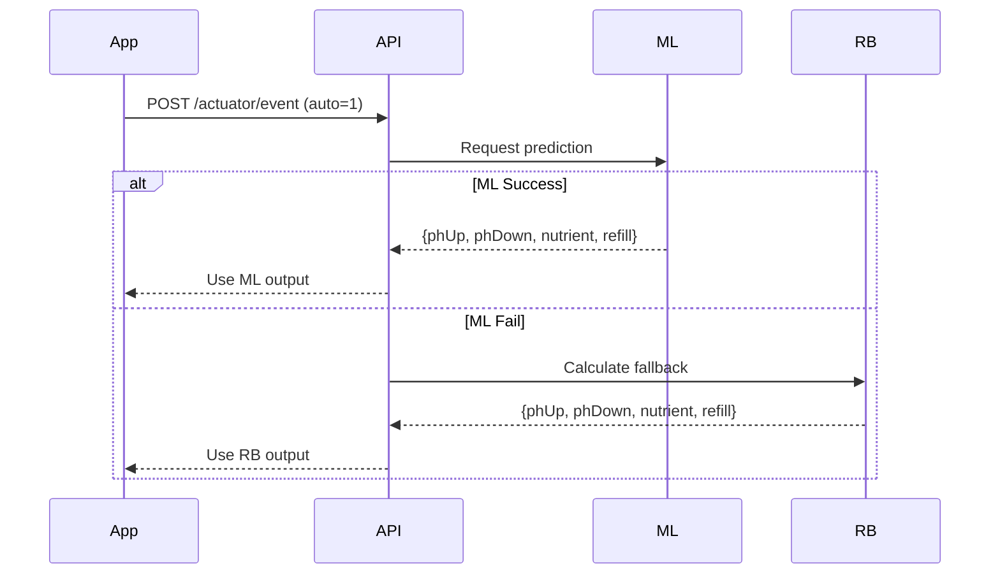

# Control System Documentation

## Overview

This document describes the three control systems used in the CEA Hydroponics project:
1. **Rule-Based (RB)** - Emergency fallback
2. **Fuzzy Logic** - Notification severity
3. **Machine Learning (ML)** - Primary control

```
┌─────────────────────────────────────────────────────────┐
│                    AUTO MODE FLOW                        │
├─────────────────────────────────────────────────────────┤
│                                                          │
│  Sensor Data ──► ML Predict ──┬──► Success → Use ML     │
│                               └──► Fail → Use RB        │
│                                                          │
│  Fuzzy Logic runs independently for notifications        │
│                                                          │
└─────────────────────────────────────────────────────────┘
```

---

## 1. Rule-Based (RB) Control

**Location:** `services/api/actuator.py`  
**Purpose:** Emergency fallback when ML fails

### Thresholds

| Parameter | Min | Max | Target |
|-----------|-----|-----|--------|
| pH | 5.5 | 6.5 | 6.0 |
| PPM | 560 | 840 | 700 |
| Water Level | 1.2 | 2.5 | 1.8 |

### Formulas

#### pH Control
```python
if ph < 5.5:  # Too acidic
    phUpSec = min(50, (5.5 - ph) * 50)
    
if ph > 6.5:  # Too alkaline
    phDownSec = min(50, (ph - 6.5) * 50)
```

#### Nutrient Control
```python
if ppm < 560:  # Low nutrients
    error = 560 - ppm
    nutrientSec = min(63, (error / 100) * 63)
```

#### Water Level / Dilution
```python
if wl < 1.2:  # Critical low
    refillSec = 60

if ppm > 840:  # Dilution needed
    v_air_ml = 10000 * ((ppm / 840) - 1)
    refillSec = min(120, v_air_ml / 1.58)
```

### Constants
- Tank volume: 10,000 ml (10L)
- Pump flow rate: 1.58 ml/s
- pH pump: ~80ml per 1 pH change = 50 seconds
- Nutrient pump: ~100ml per 100 ppm = 63 seconds

### Duration Formulas Derivation

#### 1. Error Calculation (P-Control)

Based on PID control theory (simplified to P-control):

```
u(t) = Kp × e(t)

Where:
  u(t) = control signal (pump duration in seconds)
  e(t) = error = setpoint - input
  Kp  = proportional gain constant
```

For each parameter:
- **pH:** e(t) = 6.0 - pH_actual, Kp = 50
- **PPM:** e(t) = 700 - PPM_actual, Kp = 0.63

---

#### 2. Rumus Kenaikan PPM (Penambahan Nutrisi)

Based on mass balance equation:

```
        (Cf - Ci) × V
Vadd = ───────────────
            Cs
```

**Dimana:**
- Ci = ppm awal (actual)
- Cf = ppm akhir (target)
- Cs = ppm larutan stok (10,000 ppm)
- V = volume tangki (10 L)

**Perhitungan untuk Kenaikan 100 ppm:**
```
ΔC = 100 ppm
V = 10 L
Cs = 10,000 ppm

Vadd = (100 × 10) / 10,000 = 0.1 L = 100 ml
```

**Konversi ke waktu:**
```
t = Vadd / Q = 100 ml / 1.58 ml/s ≈ 63 seconds
```

---

#### 3. Rumus Pengenceran (Penurunan PPM)

Based on dilution equation from journal *"Studi Pengenceran Koagulan Menggunakan Air Bersih di IPA Cilandak"*:

```
C₁ × V₁ = C₂ × V₂
```

**Turunan untuk volume air yang ditambahkan:**

```
Ci × V = Cf × (V + Vair)

        ┌      ┐
        │  Ci  │
Vair = V│ ──── - 1│
        │  Cf  │
        └      ┘
```

**Dimana:**
- Ci = konsentrasi awal (ppm)
- Cf = konsentrasi akhir (ppm)  
- V = volume tangki awal
- Vair = volume air yang ditambahkan

**Contoh:**
```
Ci = 1000 ppm, Cf = 840 ppm, V = 10 L

Vair = 10 × (1000/840 - 1)
Vair = 10 × 0.19 = 1.9 L = 1900 ml

t = 1900 / 1.58 = 1202 s → capped at 120 s
```

---

#### 4. Rumus pH Control

```
u(t) = Kp × e(t)

Where:
  e(t) = setpoint - pH_actual
  Kp = 50 (empirically determined)
  setpoint = 6.0 (for hydroponics lettuce)
```

**Contoh:**
```
pH_actual = 5.3
e(t) = 6.0 - 5.3 = 0.7
u(t) = 50 × 0.7 = 35 seconds
```

---

#### 5. Rumus Water Level Refill

**Proportional control:**
```
t_refill = Kp × (WL_target - WL_actual)

Where:
  Kp = 30-50 (proportional constant)
  WL_target = 1.8 L
```

**Emergency (WL < 1.2):** Fixed 60 seconds

---

### Summary Table

| Actuator | Formula | Kp | Max | Unit |
|----------|---------|-----|-----|------|
| pH Up/Down | `Kp × e(t)` | 50 | 50 | seconds |
| Nutrient | `((ΔC × V) / Cs) / Q` | - | 63 | seconds |
| Dilution | `V × (Ci/Cf - 1) / Q` | - | 120 | seconds |
| Refill | `Kp × e(t)` or fixed | 30-50 | 60 | seconds |

### Constants

| Constant | Value | Description |
|----------|-------|-------------|
| V | 10 L | Tank volume |
| Q | 1.58 ml/s | Pump flow rate |
| Cs | 10,000 ppm | Nutrient stock concentration |
| pH setpoint | 6.0 | Target pH |
| PPM setpoint | 700 | Target PPM |
| WL setpoint | 1.8 L | Target water level |

### Reference
- Rumus pengenceran: *Studi Pengenceran Koagulan Menggunakan Air Bersih di IPA Cilandak*
- P-Control: *Analisis Penerapan Kendali Otomatis*

---

## 2. Fuzzy Logic

**Location:** `apps/mobile/lib/core/fuzzy.dart`  
**Purpose:** Determine notification severity

### Membership Functions

```
LOW          NORMAL         HIGH
 ▄▄▄▄▄         ▄▄▄▄▄         ▄▄▄▄▄
█     ▀▄     ▄▀     ▀▄     ▄▀     █
█       ▀▄ ▄▀         ▀▄ ▄▀       █
──────────────────────────────────────
      min  target  max
```

### Parameters

| Parameter | Low | Normal | High | Critical |
|-----------|-----|--------|------|----------|
| pH | <5.5 | 5.5-6.5 | >6.5 | <5.0, >7.0 |
| PPM | <560 | 560-840 | >840 | <400, >1000 |
| Water Level | <1.2 | 1.2-2.5 | >2.5 | <1.0 |
| Temperature | <18 | 18-28 | >28 | <15, >32 |
| Humidity | <40 | 40-80 | >80 | <30, >90 |

### Severity Output

| Severity | Condition | Color |
|----------|-----------|-------|
| `none` | All normal | - |
| `info` | 1 param slightly off | Blue |
| `warning` | 2+ params off or 1 moderate | Yellow |
| `urgent` | Any critical | Red |

---

## 3. Machine Learning (ML) Control

**Location:** `services/ml/`  
**Purpose:** Primary control with multi-variable optimization

### Files

| File | Purpose |
|------|---------|
| `generate_dataset.py` | Generate training data |
| `predictor.py` | Model inference |
| `model_registry/` | Trained model files |

### Model Specification

- **Algorithm:** Multi-Output Random Forest Regressor
- **Features:** ppm, ph, tempC, humidity, waterTemp, waterLevel
- **Targets:** phUp, phDown, nutrientAdd, refill
- **Training samples:** 40,000

### Multi-Variable Interactions

| # | Interaction | Behavior | Benefit |
|---|-------------|----------|---------|
| 1 | pH + Nutrient | Skip nutrient if pH unstable | Save nutrient |
| 2 | Temp + Nutrient | Reduce dose at high temp | Prevent overdose |
| 3 | Humidity + WL | More refill at low humidity | Anticipate evaporation |
| 4 | WaterTemp | Cooling refill if >28°C | Prevent stress |

### ML vs RB Comparison

| Aspect | Rule-Based | ML |
|--------|------------|-----|
| Zone | OUTSIDE threshold | BOTH zones |
| Logic | Independent per param | Multi-variable |
| Purpose | Emergency fallback | Optimized control |
| Speed | Instant | ~100ms inference |

### Performance Metrics

| Target | MAE | R² |
|--------|-----|-----|
| phUp | 3.75 | 0.872 |
| phDown | 3.89 | 0.894 |
| nutrientAdd | 5.44 | 0.524 |
| refill | 19.43 | 0.635 |

---

## System Flow

### Auto Mode Activation



### Scheduler Loop

```
Every 30 seconds:
1. Query devices with autoMode=TRUE
2. For each device:
   a. Get latest telemetry
   b. Try ML prediction
   c. If fail, use RB fallback
   d. Execute actuator command
   e. Create notification
```

---

## Requirements

### Backend (Python)
- FastAPI
- scikit-learn
- joblib
- numpy, pandas

### ML Model Files
```
services/ml/model_registry/
├── model.pkl      # Random Forest model
├── scaler.pkl     # StandardScaler
└── metadata.json  # Version & metrics
```

### Mobile (Flutter)
- Riverpod (state management)
- fl_chart (graphs)
- shared_preferences

---

## API Endpoints

| Endpoint | Method | Purpose |
|----------|--------|---------|
| `/actuator/event` | POST | Trigger auto mode |
| `/ml/predict` | POST | ML prediction |
| `/telemetry/latest` | GET | Get sensor data |
| `/device/mode` | POST | Set auto/manual |
