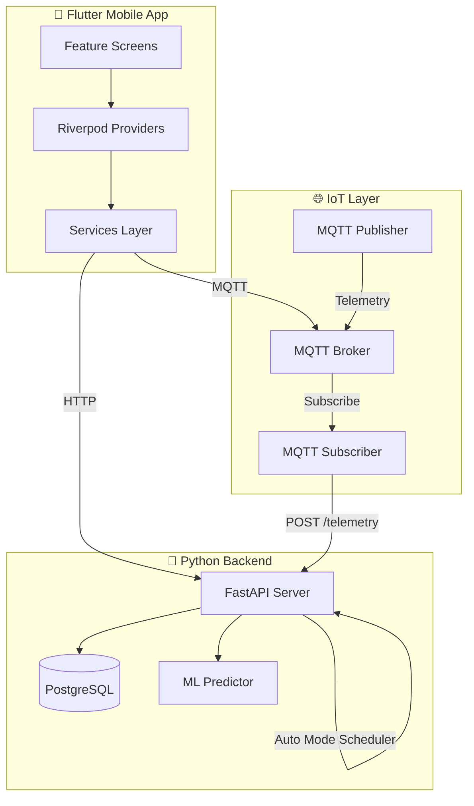

# Flutter CEA System - Flow Analysis

> **System**: Hydroponic Controlled Environment Agriculture (CEA) monitoring & control system
> **Stack**: Flutter (Riverpod) + Python FastAPI + PostgreSQL + MQTT + Machine Learning

---

## 📁 Directory Structure Overview

```
flutter-cea-system/
├── apps/mobile/lib/          # Flutter Mobile App
│   ├── main.dart             # Entry point (Firebase, Riverpod)
│   ├── app/routes.dart       # 12 named routes + AuthGate
│   ├── core/constants.dart   # MQTT config, threshold values
│   ├── domain/               # Domain models (Telemetry, DeviceStatus)
│   ├── models/               # Data classes (Kit, NavArgs)
│   ├── providers/            # Riverpod providers (state management)
│   ├── services/             # API, Auth, MQTT service layer
│   ├── features/             # UI screens (9 feature modules)
│   └── utils/                # Validators, error handlers
│
└── services/                 # Python Backend Services
    ├── api/                  # FastAPI REST API
    ├── mqtt/                 # MQTT publisher/subscriber
    └── ml/                   # Machine Learning predictor
```

---

## 🔄 Architecture Flow



---

## 📱 Flutter App Layer

### Entry Point (`main.dart`)
1. Load `.env` environment variables
2. Initialize Firebase + App Check
3. Create `ProviderScope` with `ApiService` override
4. Run `FountaineApp` with Material3 theme

### Routing (`routes.dart`)
| Route | Screen | Purpose |
|-------|--------|---------|
| `/` (splash) | `AuthGate` | Auth state check → Login/Verify/Home |
| `/login` | `LoginScreen` | Email/password login |
| `/register` | `RegisterScreen` | New user registration |
| `/verify` | `VerifyScreen` | Email verification pending |
| `/home` | `HomeScreen` | Main dashboard with feature grid |
| `/monitor` | `MonitorScreen` | Real-time telemetry + actuator control |
| `/history` | `HistoryScreen` | Telemetry timeline with date filtering |
| `/addkit` | `AddKitScreen` | Link new hydroponic kit |
| `/notifications` | `NotificationScreen` | Filtered notification list |
| `/settings` | `SettingsScreen` | App settings |
| `/profile` | `ProfileScreen` | User profile |

---

### Services Layer

#### `api_service.dart`
HTTP client wrapper with retry logic:
- **Telemetry**: `getLatestTelemetry()`, `getTelemetryHistory()`
- **Actuator**: `getLatestActuatorEvent()`
- **Device Mode**: `setDeviceMode()`, `getDeviceMode()`
- **User Preference**: `setUserPreference()`, `getUserPreference()`
- **Notifications**: CRUD operations with `days` and `level` filters

#### `auth_services.dart`
Firebase Auth wrapper:
- `signInWithEmailPassword()`, `registerWithEmailPassword()`
- `sendPasswordReset()`, `sendEmailVerification()`
- `reloadUser()` for verification status refresh

#### `mqtt_service.dart`
MQTT client with wildcard subscriptions:
- Subscribes to `kit/+/telemetry` and `kit/+/status`
- Streams: `telemetry$`, `status$`, `connectionState$`
- Publishes to `kit/{kitId}/control`

---

### Providers (Riverpod State Management)

#### `auth_provider.dart`
```dart
authProvider → StateNotifierProvider<AuthNotifier, User?>
authStateProvider → StreamProvider<User?>
```

#### `api_provider.dart`
```dart
apiServiceProvider → Provider<ApiService>
apiKitsProvider → Provider<ApiKitsService>
apiKitsListProvider → FutureProvider<List<Map>>
currentKitIdProvider → StateProvider<String?>
```

#### `mqtt_provider.dart`
```dart
mqttProvider → ChangeNotifierProvider<MqttVM>
```
- `telemetryMap`: Real-time sensor data per kit
- `statusMap`: Device online/offline status
- `enableAutoMode()` / `disableAutoMode()`: Backend sync

#### `monitor_provider.dart`
```dart
monitorTelemetryProvider → StateNotifierProvider.family<MonitorNotifier, MonitorState, String>
```
- Merges API snapshot + MQTT real-time updates
- Actuator methods: `phUp()`, `phDown()`, `nutrientAdd()`, `refill()`, `setAuto()`, `setManual()`

#### `notification_provider.dart`
```dart
notificationListProvider → StateNotifierProvider<List<NotificationItem>>
filteredNotificationProvider → Provider.family<List, String?>
unreadNotificationCountProvider → Provider<int>
```
- **Threshold evaluation**: pH (5.5-6.5), PPM (560-840), Temp (18-24°C), Water Level (1.2-2.5)
- **Auto mode**: Backend creates notifications
- **Manual mode**: Provider creates notifications + syncs to backend
- **Cooldown**: 20 seconds between same notification types

---

## 🐍 Python Backend Layer

### FastAPI Server (`main.py`)

#### Database Tables
| Table | Purpose |
|-------|---------| 
| `kits` | Global kit registry |
| `user_kits` | Many-to-many user↔kit junction |
| `telemetry` | Sensor readings with dedup hash |
| `actuator_event` | Control actions history |
| `actuator_cooldown` | Cooldown tracking per action |
| `device_mode` | Auto/manual mode per user+device |
| `user_preference` | Selected kit preference |
| `notifications` | Persistent notification storage |
| `ml_prediction_log` | ML prediction audit trail |

#### Auto Mode Scheduler
- Background thread runs every **30 seconds**
- Queries `device_mode WHERE autoMode = TRUE`
- Calls `/actuator/event?auto=1` for each device
- Creates notification with action summary

### Actuator Control (`actuator.py`)

#### Control Flow
```
1. GET latest telemetry from DB
2. TRY Machine Learning (2s timeout)
   ├── Success → Use ML predictions
   └── Fail → Fallback to Rule-Based
3. Apply Cooldown (180s) unless CRITICAL
4. Insert actuator_event
5. Update cooldown timestamps
```

#### Rule-Based Logic
- **pH Control**: P-control with Kp=1 (1 pH = 50 seconds)
- **Nutrient**: 100 ppm = 63 seconds pump time
- **Refill**: Fixed 60s for low water OR dilution formula for high PPM

#### Critical Thresholds (Bypass Cooldown)
- pH: < 5.0 or > 7.0
- PPM: < 400 or > 1200
- Water Level: < 1.0

---

## 🌐 MQTT Data Flow

### Publisher (`publisher.py`)
- **Mode**: Single-kit (`KIT_ID` env) or Multi-kit (auto-discover from `/kits/all`)
- **Sensor Intervals**:
  | Sensor | Interval |
  |--------|----------|
  | tempC, humidity | 5s |
  | waterLevel | 10s |
  | waterTemp | 15s |
  | ppm | 20s |
  | ph | 30s |
- **Auto-refresh**: Checks for new kits every 3 seconds
- **Topic**: `kit/{kitId}/telemetry`

### Subscriber (`subscriber.py`)
- Subscribes to `kit/+/telemetry` (wildcard)
- Aggregates partial payloads until all 6 sensors received
- POSTs complete snapshot to `/telemetry?deviceId={kitId}`

---

## 🤖 Machine Learning (`predictor.py`)

### Model
- **Type**: RandomForest (MultiOutput Regressor)
- **Input Features**: `ppm`, `ph`, `tempC`, `humidity`, `waterTemp`, `waterLevel`
- **Output Targets**: `phUp`, `phDown`, `nutrientAdd`, `refill` (seconds)

### Model Registry
- Version-controlled in `services/ml/model_registry/`
- `LATEST` file points to active version
- Includes `model.pkl`, `scaler.pkl`, `metadata.json`

---

## 🔐 Data Validation

### Backend Validation
| Field | Constraint |
|-------|------------|
| `userId` | ≥ 8 chars, no test patterns |
| `deviceId` | ≥ 5 chars |

### Frontend Validation (`validators.dart`)
- Email: Regex validation
- Password: ≥ 8 characters

### Database Constraints
```sql
CHECK (LENGTH("userId") >= 8)
CHECK (LENGTH("deviceId") >= 5)
CHECK ("userId" != '')
CHECK ("deviceId" != '')
```

---

## 📱 Feature Screens Summary

| Screen | Key Features |
|--------|--------------|
| **HomeScreen** | Feature grid (4 cards), weather widget, bottom nav |
| **MonitorScreen** | 6 sensor gauges, kit selector with delete, auto/manual toggle |
| **HistoryScreen** | Date picker, time filters (1h/6h/all), sort toggle, FAB → notifications |
| **NotificationScreen** | Filter chips (info/warning/urgent), swipe-to-delete, glassmorphism |
| **AddKitScreen** | Kit name/ID form with validation |

---

## 🔑 Key Integration Points

### Flutter ↔ Backend
1. **Kit Management**: `POST /kits`, `GET /kits?userId=`, `DELETE /kits/{id}?userId=`
2. **Telemetry**: `GET /telemetry/latest`, `GET /telemetry/history`
3. **Device Mode**: `POST /device/mode`, `GET /device/mode`
4. **Notifications**: Full CRUD with batch operations

### Flutter ↔ MQTT
1. **Subscribe**: `kit/+/telemetry`, `kit/+/status`
2. **Publish**: `kit/{kitId}/control` with `{cmd, data, ts}`

### Backend ↔ ML
1. **Synchronous call**: 2s timeout during `/actuator/event`
2. **Fallback**: Rule-based if ML fails

---

> **Analysis Complete** - All `lib/` (Flutter) and `services/` (Python) files reviewed.
