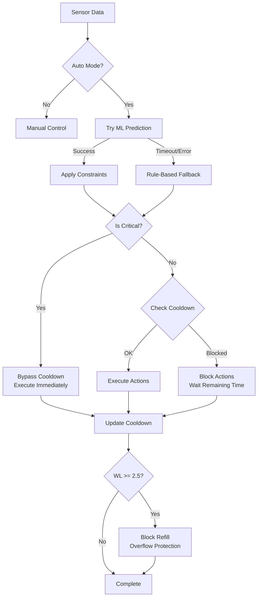

# Safety Mechanisms Documentation

Dokumentasi lengkap tentang mekanisme keamanan dan kontrol dalam sistem CEA Hydroponic.

---

## Table of Contents

- [Knowledge Distillation](#knowledge-distillation)
- [Preventive Control](#preventive-control)
- [Cooldown Mechanism](#cooldown-mechanism)
- [Critical Safety Mechanism](#critical-safety-mechanism)
- [Safety Hierarchy](#safety-hierarchy)

---

# Knowledge Distillation

## Overview

**Knowledge Distillation** adalah teknik transfer learning dimana model "guru" (Rule-Based) melatih model "murid" (Machine Learning) yang lebih fleksibel. Ini **BUKAN** imitasi sederhana, melainkan proses transfer pengetahuan yang menghasilkan model superior.

## Definisi Akademik

Knowledge Distillation (KD) adalah metode dimana:
- **Teacher Model** (RB): Menyediakan baseline deterministik dan aman
- **Student Model** (ML): Belajar pola dari teacher + generalisasi beyond rules
- **Result**: Model yang lebih baik dari teacher dalam skenario multi-variable

## Implementasi dalam CEA System

### Teacher Model: Rule-Based System

**Lokasi:** `services/api/actuator.py` (Lines 349-405)

```python
# Rule-Based Control (Teacher)
if ph < PH_MIN:          # 5.5
    error = PH_MIN - ph
    phUpSec = min(50, error * 50)
elif ph > PH_MAX:        # 6.5
    phDownSec = min(50, error * 50)
```

**Karakteristik RB:**
- Deterministik dan dapat diprediksi
- Hanya aktif di LUAR threshold (reaktif)
- Menggunakan 3 input: pH, PPM, Water Level

### Student Model: Machine Learning

**Lokasi:** `services/ml/predictor.py`

```python
# ML Model (Student)
TELEMETRY_FEATURES = ["ppm", "ph", "tempC", "humidity", "waterTemp", "waterLevel"]
TARGETS = ["phUp", "phDown", "nutrientAdd", "refill"]
```

**Keunggulan ML dibanding RB:**
- Menggunakan **6 features** (vs 3 pada RB)
- Aktif di dalam DAN luar threshold (**preventive**)
- Memahami **7 interaction rules** antar parameter

## Feature Importance

Hasil training menunjukkan ML berhasil mempelajari pola kompleks:

| Rank | Feature | Importance | Kategori |
|------|---------|-----------|----------|
| 1 | `ph` | **50.7%** | Primary |
| 2 | `ppm` | **18.2%** | Primary |
| 3 | `waterLevel` | **16.6%** | Primary |
| 4 | `tempC` | **4.3%** | Environmental |
| 5 | `humidity` | **3.9%** | Environmental |
| 6 | `waterTemp` | **3.9%** | Environmental |

**Key Insight:** Environmental features memberikan kontribusi **12.1%** - memvalidasi pendekatan multi-variable.

## Multi-Variable Interactions

ML mempelajari 7 interaction rules yang tidak bisa di-encode dalam RB:

| # | Interaction | ML Logic | Resource Saved |
|---|-------------|----------|----------------|
| 1 | pH + Nutrient | Skip nutrient jika pH tidak stabil | Nutrient waste |
| 2 | Temp + Nutrient | Reduce dose di temp tinggi (>28°C) | Overdose stress |
| 3 | Humidity + WL | More refill di humidity rendah (<40%) | Pump efficiency |
| 4 | WaterTemp + Cooling | Small refill untuk cooling (>28°C) | Plant stress |
| 5 | Inside vs Outside pH | Gentle (25s) vs Aggressive (50s) | Oscillation |
| 6 | PPM depends on pH | No nutrient unless pH stable | System stability |
| 7 | Multi-param refill | WL + PPM dilution optimization | Water usage |

## Perbandingan Performa

| Metrik | Rule-Based | Machine Learning | Improvement |
|--------|-----------|-----------------|-------------|
| MAE Overall | 11.89s | **5.88s** | **+50.2%** |
| R² Score | -0.379 | **0.464** | Significant |
| phUp MAE | 7.26s | **3.75s** | +48.4% |
| nutrientAdd MAE | 13.47s | **5.44s** | +59.6% |

> [!IMPORTANT]
> RB memiliki R² negatif (-0.379), artinya prediksinya **lebih buruk dari memprediksi rata-rata**. ML mencapai R² positif (0.464) dengan error 50% lebih rendah.

## Referensi Akademik

1. **"Rule Distillation: Distilling Knowledge from Textual Rules into LLMs"** - ACL Anthology 2024
2. **"Knowledge Distillation in Machine Learning"** - arXiv 2024
3. **"Hybrid Rule-Based Machine Learning Fallback Control Systems"** - IEEE 2024

---

# Preventive Control

## Overview

**Preventive Control** adalah filosofi kontrol dimana sistem melakukan tindakan korektif SEBELUM parameter keluar dari range optimal. Ini berbeda dengan **Reactive Control** yang hanya bertindak setelah masalah terjadi.

## Perbandingan Filosofi Kontrol

```
┌─────────────────────────────────────────────────────────────┐
│                    REACTIVE (Rule-Based)                    │
├─────────────────────────────────────────────────────────────┤
│  [SAFE ZONE]      │ [THRESHOLD] │      [ACTION ZONE]       │
│                   │             │                          │
│  No action ────────────────────────► Aggressive correction │
│                   │             │                          │
│  pH: 5.6 → 0s     │    5.5      │    pH: 5.4 → 30s        │
└─────────────────────────────────────────────────────────────┘

┌─────────────────────────────────────────────────────────────┐
│                   PREVENTIVE (Machine Learning)             │
├─────────────────────────────────────────────────────────────┤
│  [GENTLE ZONE]    │ [THRESHOLD] │    [AGGRESSIVE ZONE]     │
│                   │             │                          │
│  Gentle fix ──────────────────────► Aggressive correction  │
│                   │             │                          │
│  pH: 5.6 → 3s     │    5.5      │    pH: 5.4 → 30s        │
└─────────────────────────────────────────────────────────────┘
```

## Implementasi Preventive Control

### Rule-Based (Reactive Only)

**Lokasi:** `services/api/actuator.py` (Lines 369-376)

```python
# RB: Hanya aktif di LUAR threshold
if ph < PH_MIN:          # 5.5 - OUTSIDE threshold
    error = PH_MIN - ph
    phUpSec = min(50, error * 50)  # Aggressive
elif ph > PH_MAX:        # 6.5 - OUTSIDE threshold
    phDownSec = min(50, error * 50)  # Aggressive
# ELSE: No action (inside threshold)
```

### Machine Learning (Preventive)

**Lokasi:** `services/ml/generate_dataset.py` (Lines 64-82)

```python
# ML: Aktif di DALAM + LUAR threshold
if ph < PH_TARGET:       # 6.0 - Target (not threshold)
    error = PH_TARGET - ph
    if ph < PH_MIN:      # OUTSIDE: Aggressive
        phUpSec = min(50, error * 50)
    else:                # INSIDE: Gentle maintenance
        phUpSec = min(25, error * 50)
```

## Perbandingan Output

| Kondisi pH | RB Output | ML Output | Behavior |
|------------|-----------|-----------|----------|
| 5.2 (outside) | 15-50s | 15-50s | Keduanya aggressive |
| 5.7 (inside) | **0s** | **2-5s** | ML preventive |
| 6.0 (target) | 0s | 0s | Keduanya stable |
| 6.3 (inside) | **0s** | **2-5s** | ML preventive |
| 6.8 (outside) | 10-50s | 10-50s | Keduanya aggressive |

## Hasil Analisis Kuantitatif

**Inside Threshold Performance:**

| Actuator | ML Active | RB Active | ML % | RB % | Advantage |
|----------|-----------|-----------|------|------|-----------|
| phUp | **451/451** | 0/451 | **100%** | 0% | +451 preventive |
| phDown | **451/451** | 0/451 | **100%** | 0% | +451 preventive |
| nutrientAdd | **451/451** | 0/451 | **100%** | 0% | +451 preventive |
| refill | **451/451** | 0/451 | **100%** | 0% | +451 preventive |
| **Total** | **1,804** | **0** | **100%** | **0%** | **+1,804 actions** |

> [!TIP]
> ML provides **100% preventive maintenance** inside threshold, sementara RB provides **0% actions** (reactive only).

## Manfaat Preventive Control

1. **Stabilitas yang Lebih Baik**
   - Mencegah parameter drift sebelum keluar threshold
   - Mengurangi frekuensi aggressive corrections

2. **Efisiensi Resource**
   - Gentle mode (2-5s) vs Aggressive mode (15-50s)
   - Small preventive cost << Large reactive cost

3. **Mengurangi Oscillation**
   - Tidak ada overshoot dari koreksi berlebihan
   - Sistem lebih smooth dan predictable

---

# Cooldown Mechanism

## Overview

**Cooldown Mechanism** adalah sistem pembatasan waktu antar eksekusi aktuator untuk mencegah overuse, melindungi hardware, dan menghindari oscillation.

## Konfigurasi Cooldown

**Lokasi:** `services/api/actuator.py` (Line 63)

```python
COOLDOWN_SECONDS = 180  # 3 menit antara actions
```

**Purpose:**
- Mencegah aktivasi aktuator berlebihan
- Melindungi umur pump/solenoid
- Menghindari overcorrection oscillations

## Database Tracking

**Lokasi:** `services/api/database.py` (Lines 110-120)

```sql
CREATE TABLE IF NOT EXISTS actuator_cooldown (
    id SERIAL PRIMARY KEY,
    "deviceId" TEXT NOT NULL,
    "actionType" TEXT NOT NULL,
    "lastTime" BIGINT NOT NULL,
    "lastValue" FLOAT DEFAULT 0,
    UNIQUE("deviceId", "actionType")
);
```

**Fields:**
- `deviceId`: Identifier perangkat
- `actionType`: Jenis aksi (phUp, phDown, nutrientAdd, refill)
- `lastTime`: Timestamp terakhir eksekusi (ms)
- `lastValue`: Nilai aksi terakhir

## Implementasi Cooldown Check

**Lokasi:** `services/api/actuator.py` (Lines 141-191)

```python
def check_cooldown(device_id, predictions):
    """
    Check if any actions are blocked by cooldown.
    Returns dict with blocked actions set to 0.
    """
    current_time = int(time.time() * 1000)
    result = predictions.copy()
    blocked_actions = []
    
    for action_type in ["phUp", "phDown", "nutrientAdd", "refill"]:
        if predictions.get(action_type, 0) > 0:
            # Query last execution time
            SELECT "lastTime" FROM actuator_cooldown
            WHERE "deviceId" = %s AND "actionType" = %s
            
            if row:
                time_diff_sec = (current_time - last_time) / 1000.0
                
                if time_diff_sec < COOLDOWN_SECONDS:
                    # Block this action
                    result[action_type] = 0
                    remaining = int(COOLDOWN_SECONDS - time_diff_sec)
                    blocked_actions.append(f"{action_type}:{remaining}s")
    
    return result
```

## Implementasi Cooldown Update

**Lokasi:** `services/api/actuator.py` (Lines 194-221)

```python
def update_cooldown(device_id, predictions):
    """Update cooldown timestamps for executed actions."""
    current_time = int(time.time() * 1000)
    
    for action_type in ["phUp", "phDown", "nutrientAdd", "refill"]:
        if predictions.get(action_type, 0) > 0:
            INSERT INTO actuator_cooldown 
                ("deviceId", "actionType", "lastTime", "lastValue")
            VALUES (%s, %s, %s, %s)
            ON CONFLICT ("deviceId", "actionType")
            DO UPDATE SET "lastTime" = EXCLUDED."lastTime"
```

## Cooldown Flow Diagram

```
┌─────────────────────────────────────────────────────────────┐
│                    COOLDOWN FLOW                            │
├─────────────────────────────────────────────────────────────┤
│                                                             │
│  ML/RB Prediction ──► Check Cooldown ──► Still in cooldown?│
│                                            │                │
│                                      ┌─────┴─────┐          │
│                                      │           │          │
│                                     YES         NO          │
│                                      │           │          │
│                                      ▼           ▼          │
│                               Block Action   Execute        │
│                               (set to 0)     Action         │
│                                              │               │
│                                              ▼               │
│                                         Update Cooldown      │
│                                         Timestamp            │
│                                                             │
└─────────────────────────────────────────────────────────────┘
```

## Log Output Example

```log
2025-12-24 13:40:15 | AUTO_MODE | pH=5.81 PPM=1264.6 temp=24.0C water_level=2.0
2025-12-24 13:40:15 | ML_PREDICT | phUp=13s phDown=0s nutrient=0s refill=99s
2025-12-24 13:40:15 | COOLDOWN_BLOCK | phUp:120s refill:45s
2025-12-24 13:40:15 | EXECUTED | device=CEA-02 user=xxx source=ml event_id=45754
```

> [!NOTE]
> `COOLDOWN_BLOCK | phUp:120s refill:45s` menunjukkan kedua aksi di-block karena masih dalam cooldown period dengan sisa waktu masing-masing.

---

# Critical Safety Mechanism

## Overview

**Critical Safety Mechanism** adalah sistem yang mem-bypass cooldown ketika parameter mencapai level kritis yang berbahaya untuk tanaman. Keselamatan tanaman diprioritaskan di atas proteksi hardware.

## Critical Thresholds

**Lokasi:** `services/api/actuator.py` (Lines 65-69)

```python
CRITICAL_THRESHOLDS = {
    "ph": {"min": 5.0, "max": 7.0},       # pH < 5.0 or > 7.0
    "ppm": {"min": 400, "max": 1200},     # PPM < 400 or > 1200
    "waterLevel": {"min": 1.0}            # Water level < 1.0 cm
}
```

## Perbandingan Range

| Parameter | Safe Range | Critical Range (Bypass Trigger) |
|-----------|------------|--------------------------------|
| pH | 5.5 - 6.5 | **< 5.0** atau **> 7.0** |
| PPM | 560 - 840 | **< 400** atau **> 1200** |
| Water Level | 1.2 - 2.5 L | **< 1.0 L** |

## Implementasi is_critical()

**Lokasi:** `services/api/actuator.py` (Lines 117-138)

```python
def is_critical(ph, ppm, water_level):
    """Check if telemetry values are in critical range (bypass cooldown)."""
    critical = False
    reasons = []
    
    if ph < CRITICAL_THRESHOLDS["ph"]["min"] or ph > CRITICAL_THRESHOLDS["ph"]["max"]:
        critical = True
        reasons.append(f"pH={ph:.2f}")
    
    if ppm < CRITICAL_THRESHOLDS["ppm"]["min"] or ppm > CRITICAL_THRESHOLDS["ppm"]["max"]:
        critical = True
        reasons.append(f"PPM={ppm:.1f}")
    
    if water_level < CRITICAL_THRESHOLDS["waterLevel"]["min"]:
        critical = True
        reasons.append(f"WL={water_level:.1f}")
    
    if critical:
        logger.warning(f"CRITICAL_BYPASS | {', '.join(reasons)}")
    
    return critical
```

## Critical Bypass Logic

**Lokasi:** `services/api/actuator.py` (Lines 407-428)

```python
# APPLY COOLDOWN
bypass_cooldown = is_critical(ph, ppm, wl)

if not bypass_cooldown:
    # Normal flow: check cooldown
    filtered = check_cooldown(deviceId, predictions)
    data.phUp = int(filtered["phUp"])
    # ... other actions filtered by cooldown
else:
    # CRITICAL: bypass cooldown, execute immediately
    # Actions proceed without cooldown check
```

## Example Scenarios

### Scenario 1: Normal Condition (Cooldown Applied)

```python
# Kondisi normal (inside safe range)
pH = 5.8, PPM = 700, WL = 2.0

→ ML predicts gentle maintenance (phUp: 3s)
→ Check cooldown: if last phUp < 180s ago → BLOCK
→ Result: No action (wait cooldown)
```

### Scenario 2: Critical Condition (Bypass Cooldown)

```python
# Kondisi kritis (pH dangerously low)
pH = 4.8, PPM = 700, WL = 2.0

→ ML predicts aggressive correction (phUp: 35s)
→ Critical detected: bypass_cooldown = True
→ Result: Execute immediately (ignore cooldown)
```

## Overflow Protection

**Prioritas tertinggi** dalam safety mechanism adalah overflow protection.

**Lokasi:** `services/api/actuator.py` (Lines 329-334)

```python
WL_MAX = 2.5  # Maximum tank capacity

# Post-processing constraint
if wl >= WL_MAX:
    # SAFETY: Stop refill to prevent overflow
    data.refill = 0
elif wl >= WL_MIN and ppm <= PPM_MAX:
    # Water level OK and PPM normal
    data.refill = 0
```

**Overflow Protection Decision Matrix:**

| Water Level | PPM | Refill Action |
|-------------|-----|---------------|
| < 1.2 L | Any | ✅ ON (low water emergency) |
| 1.2 - 2.5 L | > 840 | ✅ ON (dilution needed) |
| 1.2 - 2.5 L | ≤ 840 | ❌ OFF (stable) |
| ≥ 2.5 L | Any | ❌ **BLOCKED (overflow protection)** |

> [!CAUTION]
> Overflow protection adalah **critical safety feature**. Bahkan jika PPM sangat tinggi dan dilution dibutuhkan, refill akan di-block ketika water level mencapai 2.5 L untuk mencegah overflow fisik dan kerusakan hardware.

---

# Safety Hierarchy

## Priority Order

Sistem CEA menggunakan **multi-layer safety architecture** dengan prioritas sebagai berikut:

```
┌─────────────────────────────────────────────────────────────┐
│                    SAFETY HIERARCHY                         │
├─────────────────────────────────────────────────────────────┤
│                                                             │
│  PRIORITY 1: Overflow Protection (Highest)                  │
│  ├── Stop refill if WL >= 2.5L                             │
│  └── Prevents physical damage                               │
│                                                             │
│  PRIORITY 2: Critical Bypass                                │
│  ├── Bypass cooldown for emergencies                        │
│  └── pH < 5.0/> 7.0, PPM < 400/> 1200, WL < 1.0            │
│                                                             │
│  PRIORITY 3: ML Prediction                                  │
│  ├── Optimal control dengan 6 features                      │
│  └── Inside + Outside threshold                             │
│                                                             │
│  PRIORITY 4: Cooldown Block                                 │
│  ├── Protect hardware dari overuse                          │
│  └── 180 seconds antar aksi                                 │
│                                                             │
│  PRIORITY 5: RB Fallback (Safety Net)                       │
│  ├── Guarantee system tetap jalan                           │
│  └── Aktif jika ML timeout/error                           │
│                                                             │
└─────────────────────────────────────────────────────────────┘
```

## Log Tags Reference

| Tag | Meaning | Level |
|-----|---------|-------|
| `AUTO_MODE` | Auto mode triggered dengan current telemetry | INFO |
| `ML_PREDICT` | ML prediction result (after constraint validation) | INFO |
| `ML_TIMEOUT` | ML service timeout, fallback to RB | WARNING |
| `ML_ERROR` | ML service error dengan details | ERROR |
| `RULE_BASED` | Rule-based control actions | INFO |
| `COOLDOWN_BLOCK` | Actions blocked by cooldown dengan remaining time | INFO |
| `CRITICAL_BYPASS` | Critical condition bypassing cooldown | WARNING |
| `EXECUTED` | Final execution dengan device, user, source tracking | INFO |

## Complete Flow Diagram



---

## Summary

| Mechanism | Purpose | Implementation |
|-----------|---------|----------------|
| **Knowledge Distillation** | Transfer learning dari RB ke ML | ML trained dengan RB sebagai teacher |
| **Preventive Control** | Maintenance sebelum problem | ML aktif inside threshold |
| **Cooldown Mechanism** | Protect hardware dari overuse | 180s delay + database tracking |
| **Critical Safety** | Plant health priority | Bypass cooldown untuk emergencies |
| **Overflow Protection** | Prevent physical damage | Hard block at WL >= 2.5L |

> [!IMPORTANT]
> Sistem **tidak pernah mengorbankan keselamatan tanaman untuk proteksi hardware**, tapi tetap mencegah tank overflow bahkan ketika dilution dibutuhkan.
